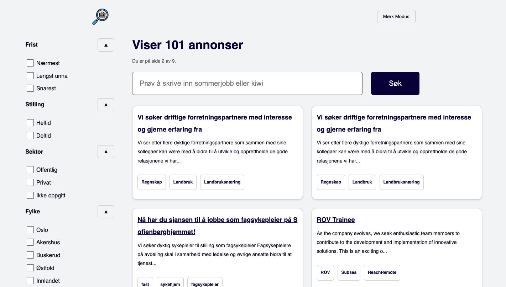

# FinnJobb

</img> </img>

This repository contains a React frontend application that displays job postings fetched from a backend Spring Boot application. The job postings are obtained by scraping various job listing websites using a custom job scraper program.

View the site at https://finnjobb.azurewebsites.net/

View the backend at https://github.com/JonathanD01/job-post-backend

View the scraper program at https://github.com/JonathanD01/job-scraper

## Features
- Display job postings retrieved from the backend Spring Boot application.
- Navigate through different pages of job postings.
- Filter and search job postings based on various criteria.

## Build
1. Clone the repository
2. Navigate to the project directory
3. Build project with `docker-compose up --build` & access page on `http://localhost`

## Dependencies
- Docker

## TODO
- Add caching
